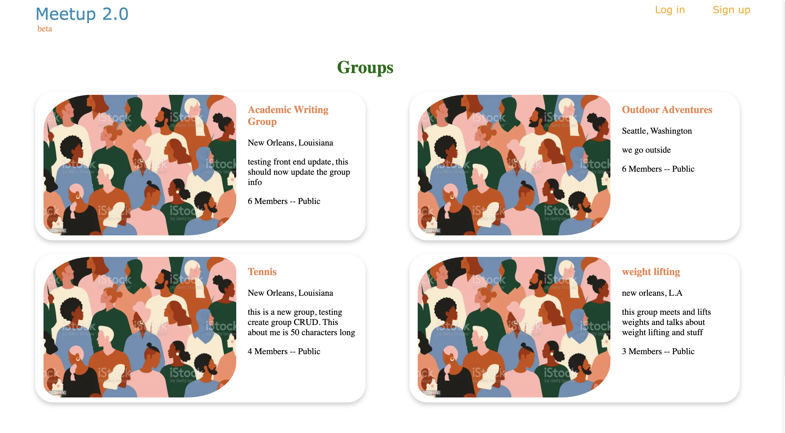
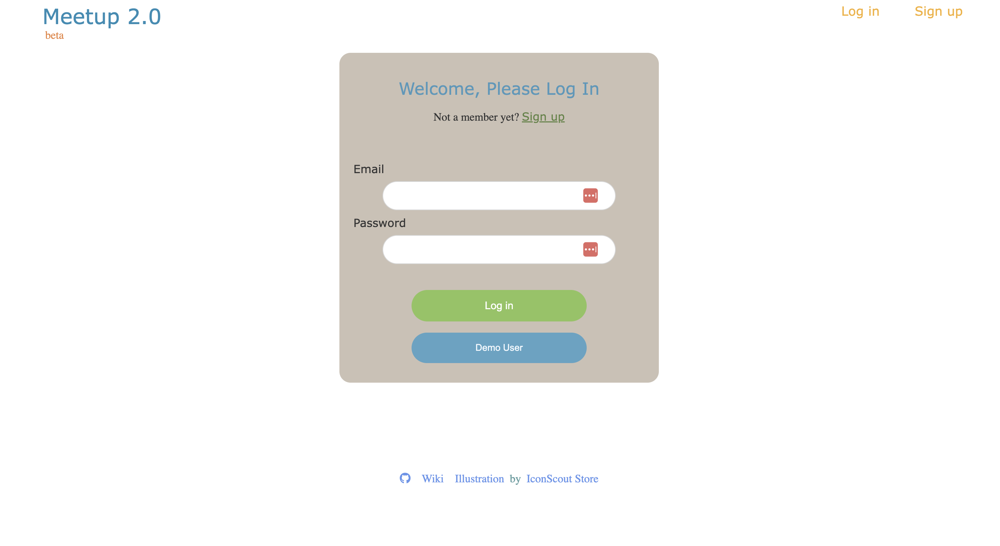

# Meetup 2.0 Project

## **Welcome**
Meetup 2.0 is an application modeled after the [Meetup](https://www.meetup.com/) site.

The site is intended for building community by joining groups with common interests.

***Explore the clone here: [Meetup2.0](https://meetup-2point0.herokuapp.com/) !***

As a guest you can check out some of the groups that are currently listed, but if you'd

like to create your own you'll have to  [Sign-up](https://meetup-2point0.herokuapp.com/signup) first OR if you already have an account you can [Login](https://meetup-2point0.herokuapp.com/login).

***Demo User***
    : The login form gives you the ability to use a demo user login details to explore the app a little more

## **Snapshots**
## Home Page

## Groups Page

## Login Form

# CRUD Features

## User
    The clone currently allows a user to:
        - Log in
        - Sign up
        - Explore groups
        - Use the DEMO USER login

## Groups
    As a logged in user you can:
        - Create a new group
        - View the groups you created or groups you've joined
        - Edit groups you created
        - Delete groups you created

## Membership
    A logged in user can:
        - Join a group (status will be pending but group will be added to 'my groups')
        - View members with non pending status in each group by clicking on individual groups
        - Leave a group (this will delete the users membership)

# Future Features

This clone is a work in progress, these features will be available in the future...

-  CRUD actions for Events
-  CRUD actions for Images (photos belonging to group and events)
-  CRUD actions for Attendance to an event
-  CRUD actions for Venues
-  Search events near you with interactive map
-  Second step to confirm group deletion
